# State flows, table by table

Every column in the API that holds a state, written from the code and checked against it on 2026-09-26. For each table:

- the **states**, with a short meaning, what sets each one, and where in the code;
- a **flowchart** of the moves between them;
- the **rules** the database or the code enforces.

Line numbers are for the code as of this review. The charts are Mermaid; they render on GitHub and in VS Code's Markdown preview (Ctrl+Shift+V).

| # | Table (schema) | State column |
|---|---|---|
| 1 | [`plan_version`](#1-plan_version-fpa_governance) (fpa_governance) | `state` (+ the `covenant_ok` flag) |
| 2 | [`plan_approval`](#2-plan_approval-fpa_governance) (fpa_governance) | `decision` |
| 3 | [`recompute_run`](#3-recompute_run-fpa_governance) (fpa_governance) | `state` and `phase` |
| 4 | [`plan_publication`](#4-plan_publication-fpa_governance) (fpa_governance) | `state` |
| 5 | [`commitment`](#5-commitment-commitment_service) (commitment_service) | `state` |
| 6 | [`variance_report`](#6-variance_report-fpa_governance) (fpa_governance) | `status` |
| 7 | [`agent_proposal`](#7-agent_proposal-fpa_governance) (fpa_governance) | `state` |
| 8 | [`plan_driver`](#8-plan_driver-fpa_governance) (fpa_governance) | `status` |
| 9 | [`scenario_set`](#9-scenario_set-fpa_governance) (fpa_governance) | `state` |

ClickHouse (`fpa_cube`) has no state column. Each plan row carries a `revision` number, and `fact_plan_line` keeps the highest revision per key. What a revision means is recorded in `plan_publication` (table 4).

---

## 1. `plan_version` (fpa_governance)

One row per plan version: the original plan (`PV-2026-0001`) and every re-forecast of it (`PV-2026-0001-R2`, `-R3`, …).

**Allowed values:** CHECK `ck_plan_version_state`, [004:53](../db/migrations/versions/004_create_plan_versions_and_scenarios.py#L53). Default `DRAFT` ([004:43](../db/migrations/versions/004_create_plan_versions_and_scenarios.py#L43)).
**Allowed moves for people:** the rows of `plan_state_transition`, seeded from [db/seed.yaml:1354](../db/seed.yaml#L1354).

| State | Meaning | Set by | Code |
|---|---|---|---|
| `DRAFT` | Being written; nobody has been asked yet | **Create draft** (`POST /plan-versions`, human planner, controller or CFO); **the worker**, when it creates a re-forecast successor; **Back to draft** (planner) on a REJECTED plan | [governance.py:114](../src/fpa_project/governance.py#L114), [activities.py:300](../src/fpa_project/recompute/activities.py#L300), [governance.py:140](../src/fpa_project/governance.py#L140) |
| `IN_REVIEW` | Waiting for a decision | **Submit for review** (planner); **the worker**, when the re-forecast parks | [governance.py:140](../src/fpa_project/governance.py#L140), [activities.py:560](../src/fpa_project/recompute/activities.py#L560) |
| `APPROVED` | Agreed; `approved_by` is filled | **Approve plan** (controller); **Approve run** (the worker sets it, then LOCKED, in one transaction) | [governance.py:186](../src/fpa_project/governance.py#L186), [activities.py:655](../src/fpa_project/recompute/activities.py#L655) |
| `LOCKED` | Final; nothing on the row or its lines can change | **Lock plan** (CFO); **Approve run** | [governance.py:140](../src/fpa_project/governance.py#L140), [activities.py:695](../src/fpa_project/recompute/activities.py#L695) |
| `REJECTED` | Turned down | **Reject plan** (controller); the worker on **Reject run**, the 72-hour timer, **Cancel run**, or a failed run | [governance.py:140](../src/fpa_project/governance.py#L140), [activities.py:710](../src/fpa_project/recompute/activities.py#L710) |
| `SUPERSEDED` | Replaced by hand | **Mark superseded** (planner), from APPROVED only | [governance.py:140](../src/fpa_project/governance.py#L140) |

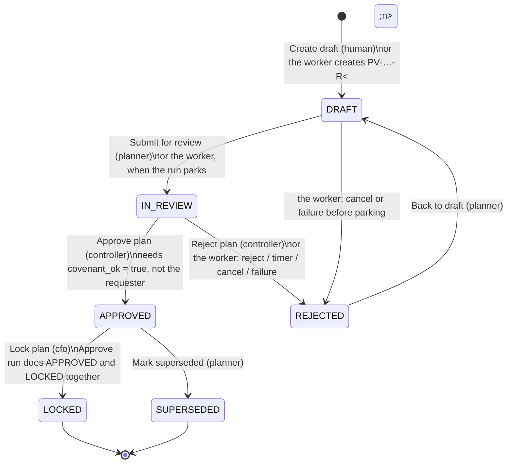

**The `covenant_ok` flag** (a yes/no on the same row, not a state):

| Value | Meaning | Set by | Code |
|---|---|---|---|
| `false` | Covenant not confirmed. The default; re-forecast successors are created with it. | Create draft; the worker | [governance.py:132](../src/fpa_project/governance.py#L132), [activities.py:321](../src/fpa_project/recompute/activities.py#L321) |
| `true` | A controller recorded a pass | **Record covenant pass**, which is `PUT /plan-versions/{code}/covenant` | [governance.py:423](../src/fpa_project/governance.py#L423) |

Nothing in the code calculates the covenant. It is the controller's recorded judgement, with a `covenant_note`.

**Rules:**
- **Covenant gate:** APPROVED or LOCKED needs `covenant_ok = true` (CHECK `ck_plan_version_covenant_before_approval`, [004:56](../db/migrations/versions/004_create_plan_versions_and_scenarios.py#L56)). Because of this, the flag can't be set back to false after approval either.
- **Approver recorded:** APPROVED or LOCKED needs `approved_by` (CHECK, [004:57](../db/migrations/versions/004_create_plan_versions_and_scenarios.py#L57)).
- **Controller-only covenant:** only a user with the `controller` role may change `covenant_ok` or `covenant_note` (trigger `plan_version_write_fields_guard`, [011:134](../db/migrations/versions/011_governance_hardening.py#L134)). The CFO holds `controller` as well.
- **Lock:** a LOCKED row, and any `plan_version_line` in it, can't be inserted, updated or deleted (triggers `plan_version_lock_guard` and `plan_line_lock_guard`, [004:155](../db/migrations/versions/004_create_plan_versions_and_scenarios.py#L155) and [014](../db/migrations/versions/014_lock_inserts_and_append_only_disclosure.py)).
- **No self-approval:** checked in code for the APPROVED step ([governance.py:182](../src/fpa_project/governance.py#L182), [activities.py:597](../src/fpa_project/recompute/activities.py#L597)).
- **Stale edits refused:** each human move must carry the `row_version` the user last read.
- **The source plan never changes.** A re-forecast leaves the original version (e.g. PV-2026-0001) LOCKED; no code moves it to SUPERSEDED. The successor records what replaced it through `supersedes_plan_version_id`.

---

## 2. `plan_approval` (fpa_governance)

The approval request for a **re-forecast** successor. The plain plan buttons in table 1 don't create rows here.

**Allowed values:** CHECK `ck_plan_approval_decision`, [005:35](../db/migrations/versions/005_create_plan_approval.py#L35). Default `PENDING`.

| State | Meaning | Set by | Code |
|---|---|---|---|
| `PENDING` | The run is parked, waiting for a person | The worker, when the run parks; one open row per version | [activities.py:560](../src/fpa_project/recompute/activities.py#L560) |
| `APPROVED` | Accepted; `decided_by` and `decided_at` are filled | **Approve run**, from a user holding both controller and CFO roles who is not the requester, and only if the successor has `covenant_ok = true` | [activities.py:655](../src/fpa_project/recompute/activities.py#L655) |
| `REJECTED` | Turned down | **Reject run** (controller, not the requester); or, recorded under the service user: the 72-hour timer, **Cancel run**, or a failed run | [activities.py:710](../src/fpa_project/recompute/activities.py#L710) |

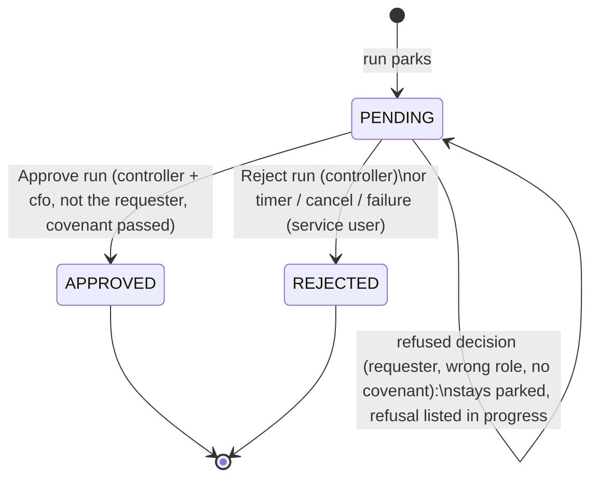

**Rules:**
- **Requester can't decide:** `decided_by` may not equal `requested_by` (CHECK `ck_plan_approval_no_self_approval`, [005:36](../db/migrations/versions/005_create_plan_approval.py#L36)).
- **A decision must be complete:** PENDING means no decider; any other value needs `decided_by` and `decided_at` (CHECK `ck_plan_approval_decision_complete`).
- **Covenant and self-approval, again:** APPROVED is refused if `covenant_ok` is false or the decider is the requester (trigger `plan_approval_guard`, [005](../db/migrations/versions/005_create_plan_approval.py)).
- **Roles come from the transition table:** approving needs roles for both IN_REVIEW → APPROVED and APPROVED → LOCKED; rejecting needs IN_REVIEW → REJECTED ([activities.py:597](../src/fpa_project/recompute/activities.py#L597)).

---

## 3. `recompute_run` (fpa_governance)

One row per re-forecast workflow run. It is a **copy** the workflow keeps up to date ([workflows.py:807](../src/fpa_project/recompute/workflows.py#L807)). The live truth is the Temporal workflow `recompute-<plan code>`; the copy is best effort (two attempts), so it can lag.

### 3a. `state`

**Allowed values:** CHECK `ck_recompute_run_state`, [008:56](../db/migrations/versions/008_create_durable_recompute.py#L56).

| State | Meaning | Set when | Code |
|---|---|---|---|
| `RUNNING` | Computing the new numbers | Run opened (with phase `STARTING`); refreshed at SNAPSHOT, at RECOMPUTING and after each batch of child workflows | [activities.py:1157](../src/fpa_project/recompute/activities.py#L1157), [workflows.py:383](../src/fpa_project/recompute/workflows.py#L383) |
| `AWAITING_APPROVAL` | Parked for a human; a refused decision keeps it here, with the reason in `detail` | Approval opened | [workflows.py:525](../src/fpa_project/recompute/workflows.py#L525) |
| `PUBLISHING` | Approved; writing to the cube, then the Commitment Service | After approval; kept through the COMMITTING, VARIANCE and COMPENSATING phases | [workflows.py:525](../src/fpa_project/recompute/workflows.py#L525) |
| `COMPLETED` | Finished | All publish steps done; **or** the same re-forecast was already published (nothing redone); **or** no plan line is bound to the shocked driver | [workflows.py:525](../src/fpa_project/recompute/workflows.py#L525), [workflows.py:770](../src/fpa_project/recompute/workflows.py#L770), [workflows.py:790](../src/fpa_project/recompute/workflows.py#L790) |
| `REJECTED` | A person rejected it | **Reject run** | [workflows.py:702](../src/fpa_project/recompute/workflows.py#L702) |
| `EXPIRED` | Nobody decided within 72 hours (`FPA_APPROVAL_TIMEOUT_HOURS`) | Timer | [workflows.py:702](../src/fpa_project/recompute/workflows.py#L702) |
| `CANCELLED` | Stopped before publishing | **Cancel run** (only acted on before approval), or Temporal cancellation | [workflows.py:740](../src/fpa_project/recompute/workflows.py#L740) |
| `COMPENSATED` | Published, then rolled back because the Commitment Service failed | Rollback succeeded | [workflows.py:647](../src/fpa_project/recompute/workflows.py#L647) |
| `FAILED` | Unrecoverable error, or the rollback itself failed | Error past its retries | [workflows.py:281](../src/fpa_project/recompute/workflows.py#L281), [workflows.py:647](../src/fpa_project/recompute/workflows.py#L647) |

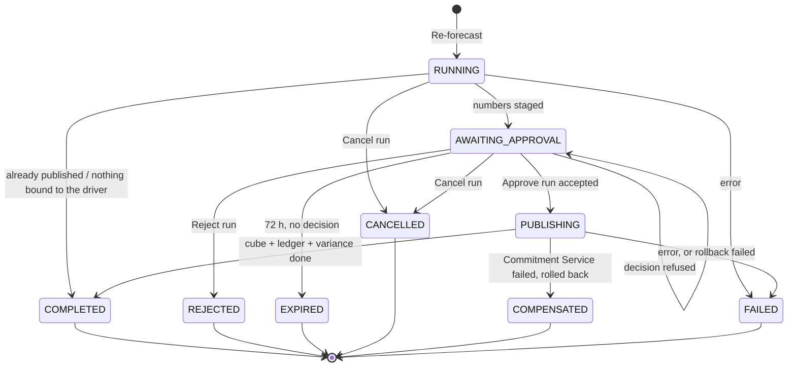

### 3b. `phase`

The step the workflow is on. The list is `PHASES` in [recompute/models.py:18](../src/fpa_project/recompute/models.py#L18), plus `FAILED`. The column only changes when the state is copied (see above), so two phases are only ever seen in the live progress query.

| Phase | What happens | Stored in the table? |
|---|---|---|
| `STARTING` | Run opened | Yes (at insert) |
| `SNAPSHOT` | Revision reserved, successor `PV-…-R<n>` created, the plan frozen into `fact_plan_line_baseline` (once per plan), active drivers read | Yes |
| `RESOLVING_DIRTY_SET` | Which plan lines the shock touches, split into partitions | Live query only |
| `RECOMPUTING` | Child workflows write `plan_version_line` (Postgres) and `fact_plan_line_staged` (cube) | Yes |
| `SAVING_DRAFT` | Children done; opening the approval | Live query only |
| `AWAITING_APPROVAL` | Parked | Yes |
| `PUBLISHING` | Check the successor is LOCKED; back up rows into `fact_plan_line_preimage`; copy staged → `fact_plan_line` | Yes |
| `COMMITTING` | POST the commitments; then release the previous revision's commitments | Yes |
| `COMPENSATING` | Release commitments, then restore the cube from the backup | Yes |
| `VARIANCE` | Write a baseline-vs-re-forecast `variance_report` per scenario | Yes |
| `DONE` | Every ending, success or not | Yes |
| `FAILED` | Error | Yes |

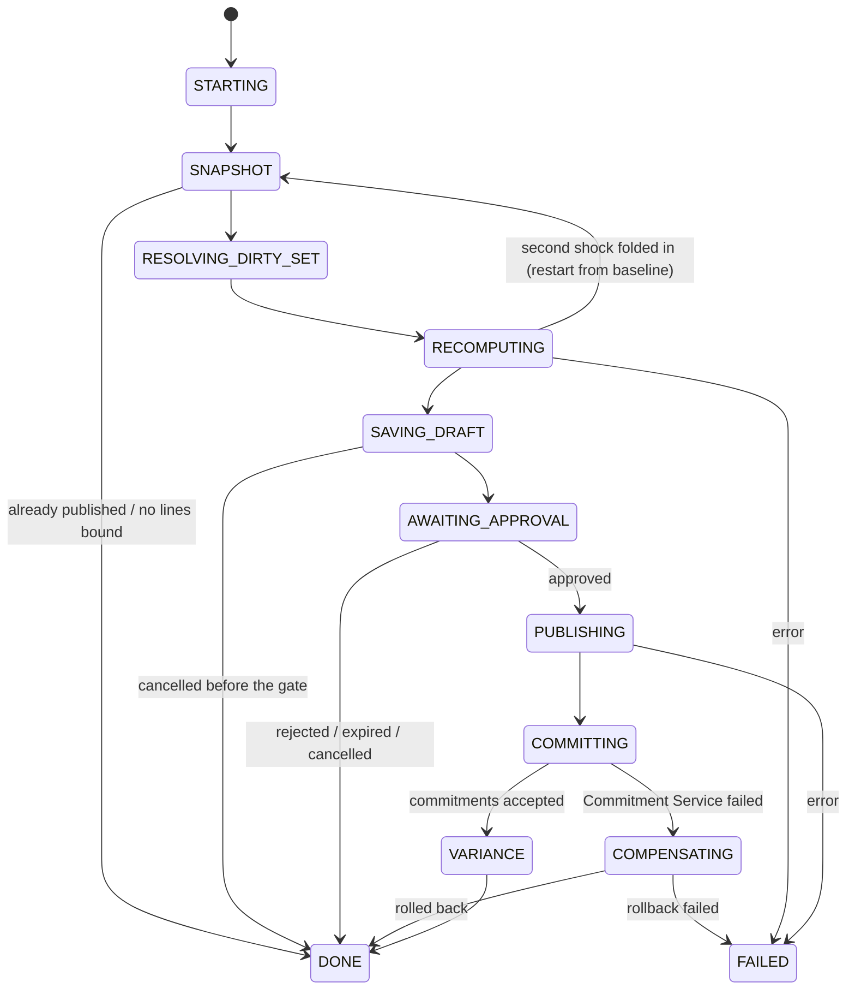

**Rules:**
- **Second shock:** accepted up to RECOMPUTING (folded in, recomputed from the baseline). Refused from AWAITING_APPROVAL onward, and for a driver this run already moved ([workflows.py:223](../src/fpa_project/recompute/workflows.py#L223)).
- **Source plan:** a re-forecast needs the source plan APPROVED or LOCKED.

---

## 4. `plan_publication` (fpa_governance)

One row per (source plan, revision): whether that revision's numbers reached the cube and the ledger.

**Allowed values:** CHECK `ck_plan_publication_state`, [008:83](../db/migrations/versions/008_create_durable_recompute.py#L83), widened by [012:39](../db/migrations/versions/012_cumulative_reforecast.py#L39). Default `RESERVED`.

| State | Meaning | Set by | Code |
|---|---|---|---|
| `RESERVED` | Revision number claimed; numbers only in `fact_plan_line_staged`. A rejected, cancelled, expired or failed run leaves the row here. | Run start | [activities.py:165](../src/fpa_project/recompute/activities.py#L165) |
| `PUBLISHED` | Rows copied into `fact_plan_line`; `row_count` filled | After approval, only from RESERVED | [activities.py:824](../src/fpa_project/recompute/activities.py#L824) |
| `COMMITTED` | The Commitment Service accepted all commitments; `commitment_ids` filled | Commit step | [activities.py:911](../src/fpa_project/recompute/activities.py#L911) |
| `COMPENSATED` | Commitments released and the cube restored from `fact_plan_line_preimage` | Rollback | [activities.py:866](../src/fpa_project/recompute/activities.py#L866) |
| `COMPENSATION_FAILED` | The rollback itself failed; cube and ledger may disagree. Needs an operator. | Rollback exhausted | [activities.py:1027](../src/fpa_project/recompute/activities.py#L1027) |
| `SUPERSEDED` | An earlier committed revision whose commitments were released because a later revision of the same plan committed | Next revision's commit, only from COMMITTED | [activities.py:244](../src/fpa_project/recompute/activities.py#L244) |

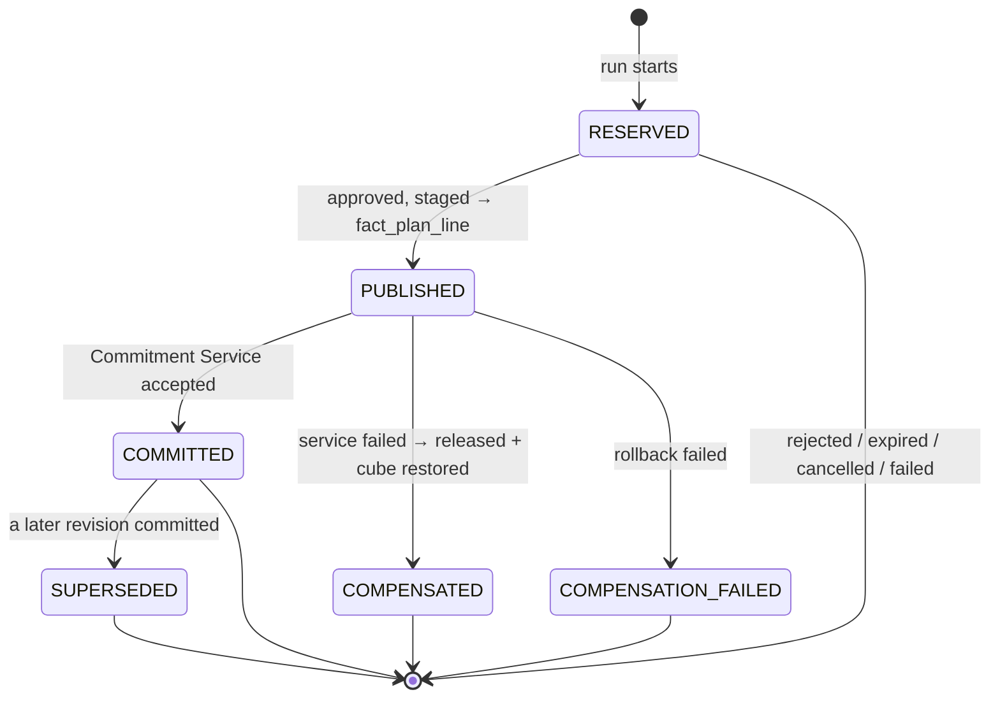

**Rules:**
- **Same shock again:** a second run finds this row. If it is PUBLISHED or COMMITTED, the run ends COMPLETED and redoes nothing ([workflows.py:770](../src/fpa_project/recompute/workflows.py#L770)).
- **Asking again after a dead end:** if the row is COMPENSATED or SUPERSEDED, or RESERVED with a REJECTED successor, its `idempotency_key` gets the suffix `:closed:<revision>` ([activities.py:188](../src/fpa_project/recompute/activities.py#L188)), so the same shock gets a fresh revision. The state itself doesn't change.
- **Publish gate:** publishing needs the successor LOCKED and the staged row count equal to its draft line count ([activities.py:758](../src/fpa_project/recompute/activities.py#L758), [activities.py:824](../src/fpa_project/recompute/activities.py#L824)).
- **Decision versus numbers:** `plan_version` holds the decision, this table holds the numbers. A compensated run leaves its successor LOCKED and this row COMPENSATED.

---

## 5. `commitment` (commitment_service)

Budget reservations held by the Commitment Service (port 8100). The table is created by the service itself ([service.py:65](../src/fpa_project/commitment/service.py#L65)); it has **no CHECK constraint**. Default `RESERVED`.

| State | Meaning | Set by | Code |
|---|---|---|---|
| `RESERVED` | Budget held for one (revision, scenario, Revenue/Cost) | `POST /commitments`, from the worker's commit step: 6 per revision | [service.py:141](../src/fpa_project/commitment/service.py#L141) |
| `RELEASED` | No longer held; `released_at` filled | `DELETE /commitments/{id}`, from compensation or from superseding an earlier revision | [service.py:207](../src/fpa_project/commitment/service.py#L207) |

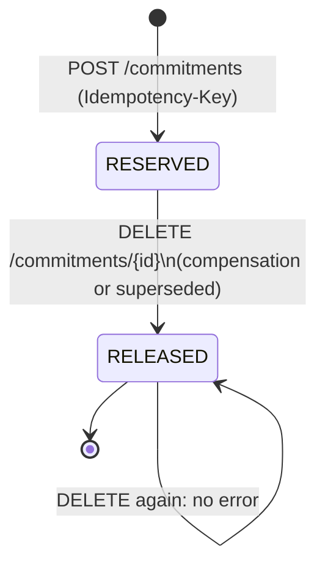

**Rules:**
- **Key format:** `<32-character hash of the shock set>:<scenario>:<Revenue|Cost>`, e.g. `2a81b559a5692c513ef71b9b83cfb721:base:Revenue`. The hash is `RecomputeInput.idempotency_key()` ([recompute/models.py:68](../src/fpa_project/recompute/models.py#L68)); it has no plan code or revision in it.
- **Same key again:** returns the first commitment unchanged, with `replayed: true`, and creates nothing.
- **Amount:** the whole published plan for that scenario and line type, in USD at `dim_fx_plan` rates.

---

## 6. `variance_report` (fpa_governance)

A persisted bridge: plan against actual (from `POST /bridge`), or baseline against re-forecast (the worker's VARIANCE phase).

**Allowed values:** CHECK `ck_variance_report_status`, [010:39](../db/migrations/versions/010_variance_report_contract.py#L39).

| Status | Meaning | Set by | Code |
|---|---|---|---|
| `OPEN` | Gap below materiality (250,000 USD) | Created by a bridge run or the worker; or moved here by hand | [bridge_service.py:130](../src/fpa_project/bridge_service.py#L130), [activities.py:1052](../src/fpa_project/recompute/activities.py#L1052) |
| `ESCALATED` | Gap at or above materiality | Created by a bridge run or the worker; or moved here | same |
| `INVESTIGATING` | Someone is looking into it | `POST /variance-reports/{id}/status` | [bridge_service.py:340](../src/fpa_project/bridge_service.py#L340) |
| `REVIEWED` | Looked at | `POST /variance-reports/{id}/status` | same |
| `CLOSED` | Done; `closed_by` and `closed_at` filled | `POST /variance-reports/{id}/status` by a human controller or CFO | same |

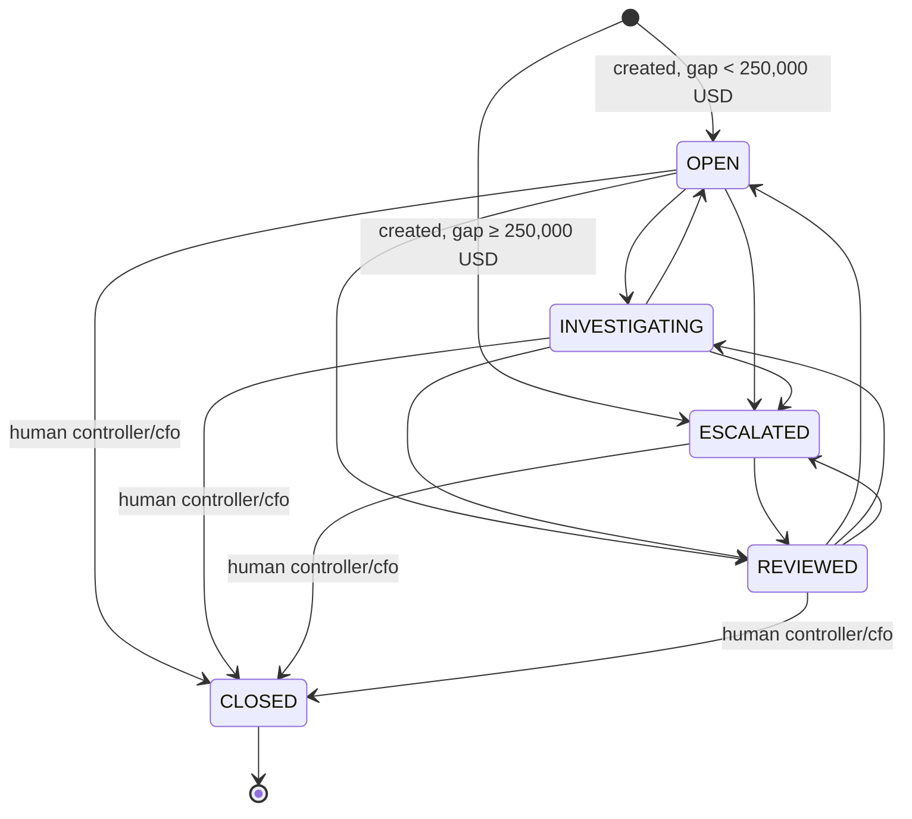

**Rules** (trigger `variance_report_status_guard`, [010:91](../db/migrations/versions/010_variance_report_contract.py#L91)):
- **Closing:** only a human user with the controller or CFO role; the database then fills `closed_by` and `closed_at` itself.
- **CLOSED is final:** a closed report can never be reopened.
- **No downgrade:** ESCALATED can't go back to OPEN or INVESTIGATING.
- **Everything else is allowed.** Any other move between OPEN, INVESTIGATING, ESCALATED and REVIEWED goes through.
- **Scope:** the API only lets a user change a report whose cited companies are all in their scope ([app.py:363](../app.py#L363)).

---

## 7. `agent_proposal` (fpa_governance)

A paused agent run that proposed a draft driver formula (`propose_driver`) and waits for a second human. Created by migration [013](../db/migrations/versions/013_agent_proposals.py).

**Allowed values:** CHECK in [013:20](../db/migrations/versions/013_agent_proposals.py#L20). Default `PENDING`.

| State | Meaning | Set by | Code |
|---|---|---|---|
| `PENDING` | The agent's run is paused on a draft formula | The agent calls `propose_driver`; the pause is saved | [proposals.py:15](../src/fpa_project/agent_team/proposals.py#L15) |
| `APPROVED` | A human accepted the draft; the agent run then continues | **Approve proposal** (human controller or CFO, not the asker) | [proposals.py:46](../src/fpa_project/agent_team/proposals.py#L46), [app.py:723](../app.py#L723) |
| `REJECTED` | A human rejected it; the agent run continues and is told so | **Reject proposal** (same rule) | same |

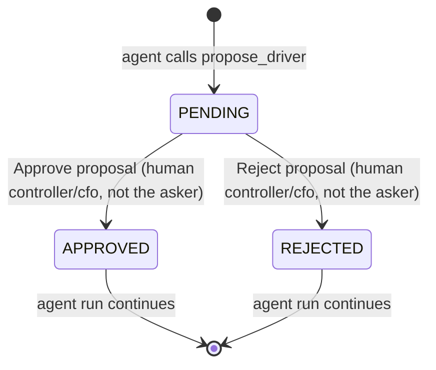

**Rules** (trigger `agent_proposal_guard`, [013:31](../db/migrations/versions/013_agent_proposals.py#L31), plus CHECKs):
- **Who decides:** only a human with the controller or CFO role, acting as themselves. The asker can't decide (CHECK, and [proposals.py:53](../src/fpa_project/agent_team/proposals.py#L53)).
- **Final:** once decided, it can't change. The same person repeating the same decision does nothing.
- **Fixed content:** the proposal's request, scope, drafts and saved run can never be edited, and rows can't be deleted.
- **What approval does:** it only resumes the agent conversation. It doesn't activate a driver or start a re-forecast.

---

## 8. `plan_driver` (fpa_governance)

The drivers (utilisation, heads …) and their formulas.

**Allowed values:** CHECK `ck_plan_driver_status`, [003:79](../db/migrations/versions/003_create_planning_model_registry.py#L79). Default `ACTIVE` ([003:75](../db/migrations/versions/003_create_planning_model_registry.py#L75)).

| Status | Meaning | Set by | Code |
|---|---|---|---|
| `ACTIVE` | Usable: appears in the Driver dropdown and can be shocked | The seed (12 drivers, by the column default) | [db/seed.yaml:1131](../db/seed.yaml#L1131) |
| `DRAFT` | Saved and validated, but not usable in a re-forecast | `POST /drivers` for a new driver | [governance.py:279](../src/fpa_project/governance.py#L279) |
| `RETIRED` | Excluded from the model | **Nothing sets it** | — |

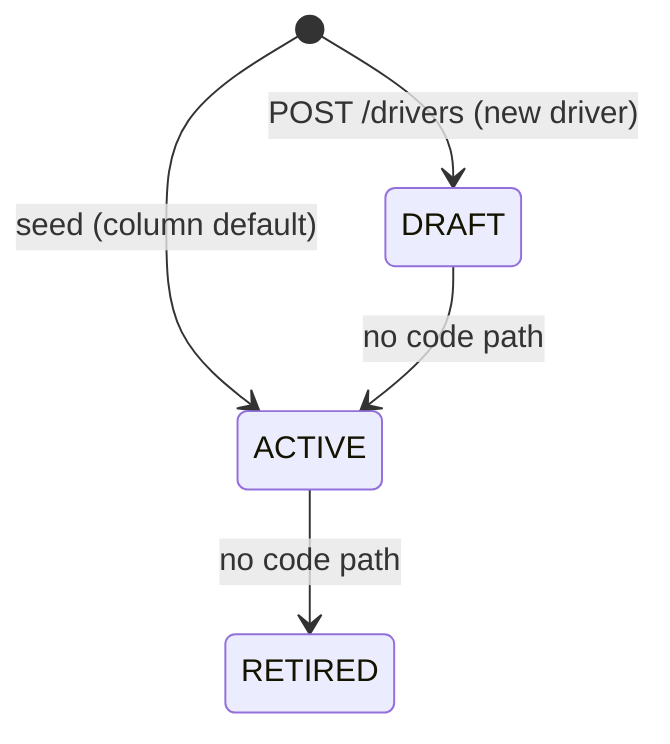

**Rules:**
- **Only ACTIVE can be shocked:** a re-forecast accepts only drivers that are ACTIVE and whose effective dates cover today; anything else is refused before any work ([activities.py:118](../src/fpa_project/recompute/activities.py#L118)).
- **Re-saving keeps the status:** `POST /drivers` on an existing driver updates the formula, name, unit and value type but leaves the status as it was. Re-saving an ACTIVE driver changes its formula and it stays ACTIVE.
- **RETIRED is only read:** validation ignores RETIRED drivers ([governance.py:270](../src/fpa_project/governance.py#L270)), but no code ever sets it.

---

## 9. `scenario_set` (fpa_governance)

The scenarios of a plan: `base`, `stretch`, `downside`.

**Allowed values:** CHECK `ck_scenario_set_state`, [004:75](../db/migrations/versions/004_create_plan_versions_and_scenarios.py#L75). Default `DRAFT`.

| State | Meaning | Set by | Code |
|---|---|---|---|
| `DRAFT` | Default | The seed (3 rows for PV-2026-0001) | [db/seed.yaml:1396](../db/seed.yaml#L1396) |
| `APPROVED` | — | **Nothing sets it** | — |
| `LOCKED` | — | **Nothing sets it** | — |

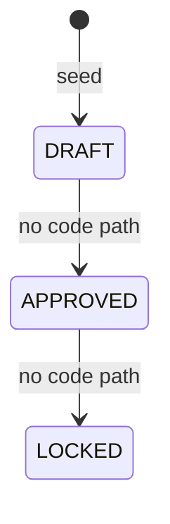

The column exists but nothing reads or moves it. A scenario's lock is effectively its plan version's lock.

---

## One re-forecast across all the tables

The example is Poland, April 2026, account 41000, base scenario. The plan is 1,000 h × 80 PLN = 80,000.00; the planner moves utilisation 0.75 → 0.74, which makes it 78,933.33.

| Step | `plan_version` | `plan_approval` | `recompute_run` state / phase | `plan_publication` (new rev) | `commitment` | Cube `fact_plan_line` |
|---|---|---|---|---|---|---|
| Submit, covenant pass, approve, lock PV-2026-0001 | 0001: DRAFT → IN_REVIEW → APPROVED → **LOCKED** | – | – | – | – | 80,000.00 (rev 1) |
| Re-forecast 0.75 → 0.74 | R2 created: DRAFT | – | RUNNING / SNAPSHOT → RECOMPUTING | RESERVED | – | 80,000.00; new value only in `fact_plan_line_staged` |
| Run parks | R2: IN_REVIEW | PENDING | AWAITING_APPROVAL | RESERVED | – | 80,000.00 |
| Controller: covenant pass on R2 | R2: `covenant_ok` → true | PENDING | AWAITING_APPROVAL | RESERVED | – | 80,000.00 |
| CFO: Approve run | R2: APPROVED → **LOCKED** | APPROVED | PUBLISHING / PUBLISHING | RESERVED | – | 80,000.00 |
| Publish | R2: LOCKED | APPROVED | PUBLISHING / PUBLISHING | PUBLISHED | – | **78,933.33 (rev 2)** |
| Commit | R2: LOCKED | APPROVED | PUBLISHING / COMMITTING | COMMITTED | 6 × RESERVED | 78,933.33 |
| Variance, end | R2: LOCKED | APPROVED | **COMPLETED** / DONE | COMMITTED | 6 × RESERVED | 78,933.33 |

**Other endings from the parked step:**

| Ending | `plan_version` R2 | `plan_approval` | `recompute_run` | `plan_publication` | `commitment` | Cube |
|---|---|---|---|---|---|---|
| Reject run | REJECTED | REJECTED | REJECTED | stays RESERVED | none | 80,000.00; staged rows deleted |
| 72 h, no decision | REJECTED | REJECTED (service user) | EXPIRED | stays RESERVED | none | 80,000.00; staged rows deleted |
| Cancel run | REJECTED | REJECTED (service user) | CANCELLED | stays RESERVED | none | 80,000.00; staged rows deleted |
| Commitment Service fails | LOCKED | APPROVED | COMPENSATED | COMPENSATED | any created → RELEASED | back to 80,000.00 (rev 1) |

---

## Status fields that are not stored in a table

These are returned by the API but never saved as a table state:

| Field | Values | Where |
|---|---|---|
| Progress `approval_state` | `NOT_YET`, `WAITING`, `DECIDED`, `CANCELLED` | [workflows.py:187](../src/fpa_project/recompute/workflows.py#L187) |
| Run result `outcome` | `PUBLISHED`, `REJECTED`, `EXPIRED`, `CANCELLED`, `COMPENSATED`, `NO_OP`, `ALREADY_PUBLISHED`, `ALREADY_<state>` | [workflows.py](../src/fpa_project/recompute/workflows.py), `RecomputeResult` |
| Agent answer `execution_status` | `SUCCESS`, `VALIDATION_ERROR`, `REJECTED_SCOPE`, `OUT_OF_SCOPE`, `AWAITING_APPROVAL`, `DRAFT`, `REFUSED` | [agent_team/models.py:78](../src/fpa_project/agent_team/models.py#L78) |

## To see every state at once

```sql
SELECT plan_version_code, state, covenant_ok, requested_by, approved_by FROM fpa_governance.plan_version ORDER BY created_at;
SELECT decision, requested_by, decided_by FROM fpa_governance.plan_approval;
SELECT state, phase, started_at FROM fpa_governance.recompute_run ORDER BY started_at DESC;
SELECT revision, state, idempotency_key FROM fpa_governance.plan_publication ORDER BY revision;
SELECT idempotency_key, revision, scenario, category, state FROM commitment_service.commitment ORDER BY revision;
SELECT status, created_by FROM fpa_governance.variance_report ORDER BY created_at DESC LIMIT 10;
SELECT state, requested_by, decided_by FROM fpa_governance.agent_proposal;
SELECT driver_code, status FROM fpa_governance.plan_driver ORDER BY driver_code;
SELECT scenario_code, state FROM fpa_governance.scenario_set;
```

---

## The whole flow in one chart

One plan from first draft to committed budget. Each box says **who acts** and **what changes, in which table**. Solid arrows are the normal path; the other exits are the ways a run can stop.

Short names used in the chart:

| Short name | Table |
|---|---|
| `plan_version` | `fpa_governance.plan_version` |
| `approval` | `fpa_governance.plan_approval` |
| `run` | `fpa_governance.recompute_run` |
| `publication` | `fpa_governance.plan_publication` |
| `commitment` | `commitment_service.commitment` |
| `report` | `fpa_governance.variance_report` |
| cube | ClickHouse `fpa_cube` tables |

```mermaid
flowchart TD
    %% ---------- Part 1: the original plan ----------
    subgraph P1["Part 1 · Author and lock the plan (PV-2026-0001)"]
        A1["<b>Planner: Create draft</b><br/>plan_version = DRAFT<br/>covenant_ok = false"]
        A2["<b>Planner: Submit for review</b><br/>plan_version = IN_REVIEW"]
        A3{"<b>Controller: covenant?</b><br/>sets covenant_ok"}
        A4["<b>Controller: Approve plan</b><br/>plan_version = APPROVED<br/>(not the requester)"]
        A5["<b>CFO: Lock plan</b><br/>plan_version = LOCKED<br/>nothing can be edited now"]
        AR["<b>Controller: Reject plan</b><br/>plan_version = REJECTED"]
        AS["<b>Planner: Mark superseded</b><br/>plan_version = SUPERSEDED<br/>(a newer plan replaced it)"]
        A1 --> A2 --> A3
        A3 -- "pass" --> A4 --> A5
        A3 -- "breach: approval is blocked,<br/>controller rejects" --> AR
        AR -- "Back to draft (planner)" --> A1
        A4 -. "optional" .-> AS
    end

    %% ---------- Part 2: the re-forecast ----------
    subgraph P2["Part 2 · Re-forecast (worker)"]
        B1["<b>Planner: Re-forecast</b><br/>utilisation 0.75 → 0.74 + reason<br/>run = RUNNING / STARTING"]
        B2["<b>SNAPSHOT</b><br/>publication rev 2 = RESERVED<br/>plan_version R2 = DRAFT (new row)<br/>cube: plan copied to fact_plan_line_baseline"]
        B3["<b>RECOMPUTING</b><br/>new lines → plan_version_line (R2)<br/>new values → fact_plan_line_staged (rev 2)<br/>live fact_plan_line unchanged"]
        B4["<b>Run parks</b><br/>plan_version R2 = IN_REVIEW<br/>approval = PENDING<br/>run = AWAITING_APPROVAL"]
        BD["<b>Already published</b><br/>(same shock again)<br/>run = COMPLETED, nothing redone"]
        B1 --> B2
        B2 -- "same shock done before" --> BD
        B2 --> B3 --> B4
    end

    %% ---------- Part 3: the decision ----------
    subgraph P3["Part 3 · Decide on R2"]
        C1["<b>Controller: covenant pass on R2</b><br/>R2 covenant_ok = true<br/>(sees impact waterfall + reason)"]
        C2{"<b>CFO: Approve run?</b>"}
        CR["<b>Refused</b><br/>(requester / no covenant / wrong role)<br/>approval stays PENDING, run stays parked"]
        CX["<b>Rejected / 72 h expired / cancelled</b><br/>plan_version R2 = REJECTED<br/>approval = REJECTED<br/>run = REJECTED / EXPIRED / CANCELLED<br/>publication stays RESERVED<br/>cube: staged rows deleted"]
        C3["<b>Approved</b><br/>approval = APPROVED<br/>plan_version R2 = APPROVED → LOCKED<br/>run = PUBLISHING"]
        C1 --> C2
        C2 -- "refused" --> CR --> C2
        C2 -- "reject / timer / cancel" --> CX
        C2 -- "approve" --> C3
    end

    %% ---------- Part 4: publish and commit ----------
    subgraph P4["Part 4 · Publish to cube, then Commitment Service"]
        D1["<b>PUBLISHING</b><br/>check R2 is LOCKED<br/>cube: old rows → fact_plan_line_preimage<br/>cube: staged → fact_plan_line (rev 2 is live)<br/>publication = PUBLISHED"]
        D2{"<b>COMMITTING</b><br/>POST 6 commitments<br/>(scenario × Revenue/Cost)"}
        D3["<b>Commit OK</b><br/>commitment × 6 = RESERVED<br/>publication = COMMITTED"]
        D4["<b>Previous revision released</b><br/>older rev's commitments = RELEASED<br/>older publication = SUPERSEDED"]
        D5["<b>VARIANCE</b><br/>report = OPEN or ESCALATED<br/>(baseline vs re-forecast, per scenario)"]
        D6["<b>DONE</b><br/>run = COMPLETED"]
        E1["<b>COMPENSATING</b><br/>any commitments = RELEASED<br/>cube: rev 2 deleted, preimage restored<br/>publication = COMPENSATED<br/>run = COMPENSATED<br/>R2 stays LOCKED"]
        E2["<b>Rollback failed</b><br/>publication = COMPENSATION_FAILED<br/>run = FAILED<br/>(operator needed)"]
        D1 --> D2
        D2 -- "accepted" --> D3 --> D4 --> D5 --> D6
        D2 -- "service failed" --> E1
        E1 -- "rollback failed" --> E2
    end

    %% ---------- Part 5: after ----------
    subgraph P5["Part 5 · After"]
        F1["<b>Controller / CFO (human only)</b><br/>report: OPEN → INVESTIGATING → REVIEWED → CLOSED<br/>CLOSED is final"]
    end

    A5 ==> B1
    B4 ==> C1
    C3 ==> D1
    D6 ==> F1
    CX -. "planner may shock again<br/>(gets a new revision)" .-> B1
    E1 -. "planner may shock again<br/>(gets a new revision)" .-> B1
```

**Reading the chart in one line per part:**

1. **Part 1:** the plan's own paperwork (`plan_version`). No numbers change.
2. **Part 2:** the worker computes new numbers into a new version (R2) and the staging table. The live cube is untouched.
3. **Part 3:** a human decides. Reject, timeout or cancel throws the staged numbers away.
4. **Part 4:** approved numbers go live in the cube, then the budget is reserved. If reserving fails, the cube is put back.
5. **Part 5:** only a human closes the variance report.
